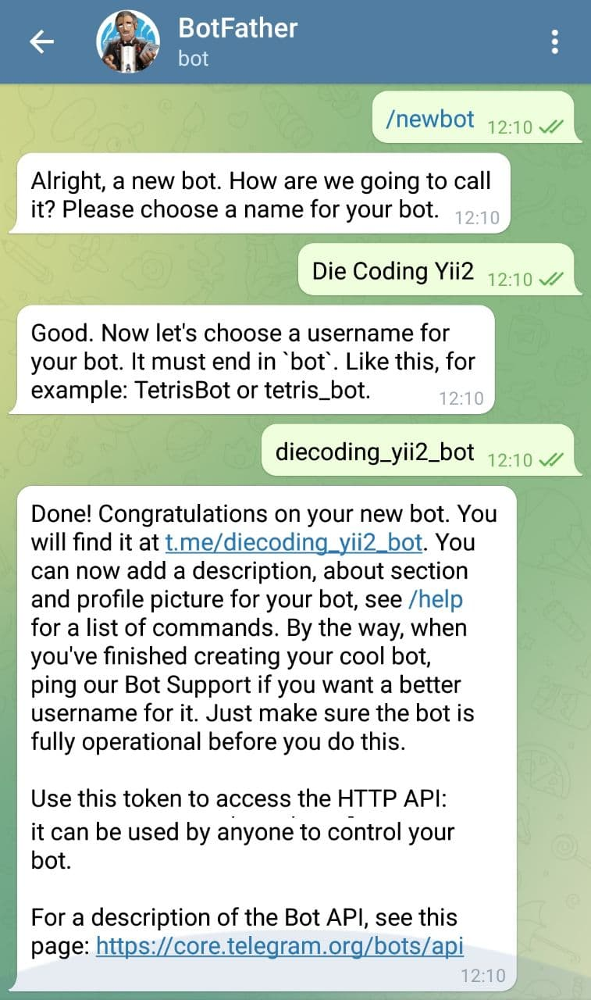
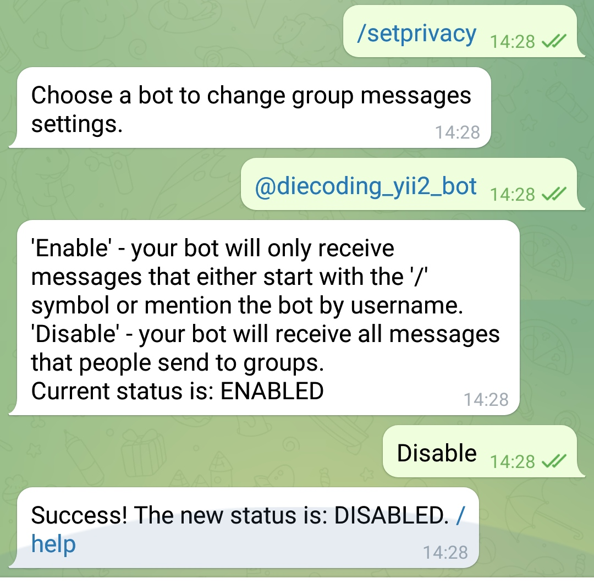

<h1 align="center">
    Yii2 Telegram Bot
</h1>
<p align="center">
	
</p>
<p align="center">
    Yii2 Telegram Bot Api Component
</p>
<p align="center">
	
[](//packagist.org/packages/die-coding/yii2-telegram-bot)
[](https://packagist.org/packages/die-coding/yii2-telegram-bot)
[](https://packagist.org/packages/die-coding/yii2-telegram-bot)
[](https://packagist.org/packages/die-coding/yii2-telegram-bot)
[](https://packagist.org/packages/die-coding/yii2-telegram-bot)
[](//packagist.org/packages/die-coding/yii2-telegram-bot)

</p>

Create your first bot
---------------------
1. Message @botfather https://telegram.me/botfather with the following text: ```/newbot``` If you don't know how to message by username, click the search field on your Telegram app and type ```@botfather```, where you should be able to initiate a conversation. Be careful not to send it to the wrong contact, because some users has similar usernames to ```botfather```.

	

2. @botfather replies with ```Alright, a new bot. How are we going to call it? Please choose a name for your bot.```.

3. Type whatever name you want for your bot.

4. @botfather replies with ```Good. Now let's choose a username for your bot. It must end in `bot`. Like this, for example: TetrisBot or tetris_bot.```.

5. Type whatever username you want for your bot, minimum 5 characters, and must end with bot. For example: ```diecoding_yii2_bot```.

6. @botfather replies with:
	```
	Done! Congratulations on your new bot. You will find it at t.me/diecoding_yii2_bot. You can now add a description, about section and profile picture for your bot, see /help for a list of commands. By the way, when you've finished creating your cool bot, ping our Bot Support if you want a better username for it. Just make sure the bot is fully operational before you do this.

    Use this token to access the HTTP API:
    5162536695:AAGdvgUMbNmTlL8sNW-SZHs32iHnTblPqEM
    Keep your token secure and store it safely, it can be used by anyone to control your bot.

    For a description of the Bot API, see this page: https://core.telegram.org/bots/api
	```

7. Note down the 'token' mentioned above.

8. Type ```/setprivacy``` to @botfather.

	

9. @botfather replies with ```Choose a bot to change group messages settings.```.

10. Type (or select) @PostMan_bot (change to the username you set at step 5 above, but start it with @)

11. @botfather replies with.
	```
	'Enable' - your bot will only receive messages that either start with the '/' symbol or mention the bot by username.
    'Disable' - your bot will receive all messages that people send to groups.
    Current status is: ENABLED
	```
12. Type (or select) ```Disable``` to let your bot receive all messages sent to a group. This step is up to you actually.

13. @botfather replies with ```Success! The new status is: DISABLED. /help```

Installation
------------

The preferred way to install this extension is through [composer](http://getcomposer.org/download/).

Either run

```
composer require diecoding/yii2-telegram-bot "*"
```

or add

```
"diecoding/yii2-telegram-bot": "*"
```

to the require section of your `composer.json` file.

Method list usable
-----
list methods
```
getMe
sendMessage
forwardMessage
sendPhoto
sendAudio
sendDocument
sendSticker
sendVideo
sendLocation
sendChatAction
getUserProfilePhotos
getUpdates
setWebhook
getChat
getChatAdministrators
getChatMembersCount
getChatMember
answerCallbackQuery
editMessageText
editMessageCaption
sendGame
Game
Animation
CallbackGame
getGameHighScores
GameHighScore
answerInlineQuery
setChatStickerSet
deleteChatStickerSet
leaveChat
pinChatMessage
unpinChatMessage
setChatDescription
setChatTitle
deleteChatPhoto 
exportChatInviteLink 
promoteChatMember
restrictChatMember
unbanChatMember
kickChatMember
editMessageLiveLocation
stopMessageLiveLocation
```

Usage
-----
first add to config.php
```php
<?php
'components' => [
	'telegram' => [
		'class' => 'diecoding\telegram\Telegram',
        'botToken' => '5162536695:AAGdvgUMbNmTlL8sNW-SZHs32iHnTblPqEM',
        'botUsername' => 'diecoding_yii2_bot',
	]
]
?>
```
Once the extension is installed, simply use it in your code by  :
```php
<?php Yii::$app->telegram->sendMessage([
	'chat_id' => $chat_id,
	'text' => 'test',
]); ?>
```
send message width inline keyboard by:
```php
<?php Yii::$app->telegram->sendMessage([
        'chat_id' => $chat_id,
        'text' => 'this is test',
        'reply_markup' => json_encode([
            'inline_keyboard'=>[
                [
                    [
                        'text' => 'refresh',
                        'callback_data' => time(),
                    ]
                ]
            ]
        ]),
    ]); ?>
```

send photo by :
```php
<?php 
Yii::$app->telegram->sendPhoto([
	'chat_id' => $chat_id,
	'photo' => Yii::$app->getBaseUrl() . '/uploads/test.jpg',
	'caption' => 'this is test'
]); ?>
```


Usage in controller
-----

First of all you need to disable the enableCsrfValidation feature in the controller

The robot is currently running from your server
But when we start /start run the robot from the telegram application on the mobile, the request does not reach the action inside the controller because the telegram sends the request to the POST and yii requests it without csrf
Sends Bad Request (# 400). So then the code doesn't run inside your method

Consider the following example
```php
class SiteController extends Controller
{
	public $enableCsrfValidation = false;

	public function actionIndex()
    {
        $res = Yii::$app->telegram->sendMessage([
            'chat_id' => $chat_id,
            'text' => 'hello world!!' 
        ]);
       
    }
}
```

## :bulb: Sample Code:


### How to get user chat_id from the bot ?
>__You can use : `$telegram->input->message->chat->id` to get chat_id__

Sample widget class :
```php
$res = Yii::$app->telegram->sendMessage([
	'chat_id' => $telegram->input->message->chat->id,
	'text' => "salam"
]);
```

## <g-emoji class="g-emoji" alias="gem" fallback-src="https://github.githubassets.com/images/icons/emoji/unicode/1f48e.png">💎</g-emoji> New feature Command
-----

How to use the command

```php
use diecoding\telegram\base\Command;

Command::run("/start", function($telegram){
   $result = $telegram->sendMessage([
      'chat_id' => $telegram->input->message->chat->id,
      "text" => "hello"
   ]);
});
```
